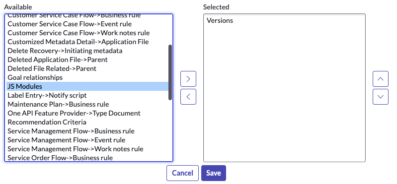

# Fluent Tools

Little helpers in addition to the built-in tooling to help you work with the new Fluent (since Xanadu) and JS Modules (since the Washington DC release) in ServiceNow for JavaScript developers using script includes, business rules, etc.

## JS Module Relationship

The JS Module creates a new relationship that you can add to the form view of any record with a script type field on it (e.g. script includes, business rules). It will parse the "require()" calls in the script and show you the referenced JS Modules in the related list. Requires you to modify the view to reference the relationship from any table you wish to use this from.

