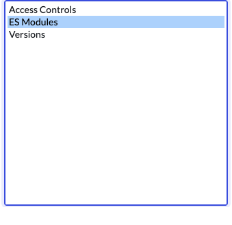

# Fluent Tools

Little helpers in addition to the built-in tooling to help you work with the new [Fluent](https://docs.servicenow.com/bundle/xanadu-api-reference/page/build/servicenow-sdk/concept/servicenow-fluent.html) (since Xanadu) and [ES Modules](https://docs.servicenow.com/bundle/washingtondc-api-reference/page/script/sdk/concept/servicenow-sdk.html) (since the Washington DC release) in ServiceNow for JavaScript developers using ServiceNow SDK (Now-SDK) with traditional assets such as business rules and script includes.

## ES Module Relationship

Applies to: Washington DC, Xanadu

The ES Modules Relationship creates a new relationship that you can add to the Core UI form view of any record with a script type field on it (e.g. script includes, business rules). It will parse the "require()" calls in the script and show you the referenced ES Modules (from the sys_module table) in a related list. Requires you to modify the view to reference the relationship from any table you wish to use this from.



## X_Require Script Include

NOTE: This is currently broken. You will get a "require not defined" error when trying to call modules from other scopes. A patch is on the way, and when it's released the following will work for you.

### How it works

In order to call a module from ES5 or cross scope it needs a wrapper in the same scope as the module. Luckily it's not necessary to map every export to the new wrapper object. Add this script include to your scope and name it `x_require`.

```javascript
var x_require = function (path) {
  return require(path);
};
```

If you're in another scope and need to call a module in Scope A it may look something like this.

```javascript
var { methodA } = x_snc_scope_a.x_require(
  "x_snc_scope_a/x-snc-jon-scoped-app/0.0.1/src/server/script.js"
);
var z = methodA(paramB);
gs.info(`Result of methodA: ${z}`);
```

### Helper UI Action

I created a UI Action on the ES Module (sys_module) table which generates a Script Include that pass through to "require" to call exported methods and properties cross-scope. To use get the `x_require` script include generated, or to get boilerplate to use it, just go to any ES Module in your scope on your instance and use the "X_Require Script Include" list action.


If you forget how to use it then just return to whichever module you wish to call and use the UI Action again--it will give you sample code. Open that ES Module and inspect all `export` statements for functions and properties which you may call using x_require.
